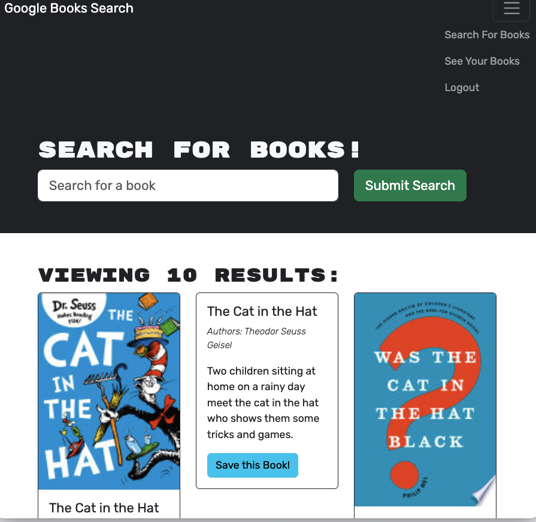

# bookSearchEngine

A search engine to find and store book titles

---

## Technology Used 

| Technology Used         | Resource URL           | 
| ------------- |:-------------:| 

| JavaScript     | [https://developer.mozilla.org/en-US/docs/Web/JavaScript](https://developer.mozilla.org/en-US/docs/Web/JavaScript)      |   
| Git            |         [https://git-scm.com/](https://git-scm.com/)     |
| MongoDB | [https://www.mongodb.com/](https://www.mongodb.com/)   | 
| Express NPM package | [https://www.npmjs.com/package/express](https://www.npmjs.com/package/express) |   
| Node.js | [https://nodejs.org/](https://nodejs.org/)     |
| React | [https://react.dev/](https://react.dev/)   |
| NPM | [https://www.npmjs.com](https://www.npmjs.com)   |

---

## Badges


---

## Description

[Visit the Github repository](https://github.com/Jeffreydne/bookSearchEngine)

[Visit the deployed site](XXXXXXXXXXX)

This application allows any user to search for books, and renders a display of multiple books that mathch the search criteria, and includes the title, author(s), an image, a link and a synopsis. The Googleapis API is used for the search. In addition to searching for a book, a user has the option of creating an account with a login, which allows them to save books they are interested in to the Mongo Database, and remove books from their account when they are no longer needed.   

---

## Instalation

No installation needed. 

---

## Code Example

The four code examples below show how to use the Apollo Server NPM and GraphQL API within a MERN based application to store data onto a MongoDB Atlas database. The first 2 examples are in on the server side where the Fetches to the database are made, and the last 2 code examples show how to provide the information needed to the server, from the client side.   

The following code is located within the typeDefs folder on the server side. Each mutation specifies the arguments needed for the Post request, and the data type of those arguments, and also the return value.

```JS
       type Mutation {
        createUser(username: String!, email: String!, password: String!): Auth
        login(email: String!, password: String!): Auth
        addBook(title: String!, description: String!, bookId: String!, authors: [String], image: String, link: String ): User
        removeBook(bookId: String!): User
    }
    
```
The following code comes from the mutation object within the resolvers object in ./server/schemas/resolvers.js. It is an async fxn that takes the arguments specified in the typeDefs typeMutation object above, and incorporates the context of the logged in user's user._id. The book data that is sent in as the args argument is then added to the savedBooks array for the user. The updated data is validated, then returned by using the 2 properties in the 3rd object argument provided in the findOneAndUpdate method. 
```JS
        addBook: async(_, args, context) => {
            try {
                const updatedUser = await User.findOneAndUpdate(
                  { _id: context.user._id },
                  { $addToSet: { savedBooks: args } },
                  { new: true, runValidators: true }
                );
                return updatedUser
              } catch (error) {
                console.log("Error adding a book: ", error);
              }
        }, 
  

```
The following code is exported on the client side from the ./client/src/utils/mutations.js file. It is imported into the ./client/src/pages/SearchBooks.jsx file. The useMutation object is imported from @Apollo/client. The ADD_BOOK function uses the mutation method to send the book data using the GraphQL server. The user_id context is provided in the handleSaveBook function in the SearchBooks.jsx file as shown below the code being shown immediately below.

```JS
 export const ADD_BOOK = gql`
    mutation Mutation(, $title: String!, $description: String!, $bookId: String!, $authors: [String], $image: String, $link: String) {
        addBook(title: $title, description: $description, bookId: $bookId, authors: $authors, image: $image, link: $link) {
            _id
            username
            email
            savedBooks {
                authors
                description
                bookId
                image
                link
                title
            }
        }
    }

```
The following code is from the ./client/src/pages/SearchBooks.jsx file. It uses the code immediately above, imported from the ./client/src/utils/mutations.js file, to add a book to the user's savedBooks array, when the Add Book button is clicked. The Add Book click calls the handleSaveBook fxn, which in turn leads to the running of the async saveBook fxn starting on line 125.

```JS
import { useMutation } from '@apollo/client';
import Auth from '../utils/auth';

import { ADD_BOOK } from '../utils/mutations';
import { searchGoogleBooks } from '../utils/API';
import { saveBookIds, getSavedBookIds } from '../utils/localStorage';
const [ saveBook ] = useMutation(ADD_BOOK);

  const handleSaveBook = async (bookId) => {
    // find the book in `searchedBooks` state by the matching id
    const bookToSave = searchedBooks.find((book) => book.bookId === bookId);

    // get token
    const token = Auth.loggedIn() ? Auth.getToken() : null;

    if (!token) {
      return false;
    }
console.log(Auth.getProfile().data);
    try {
      const { data } = await saveBook({
        variables: {
          userId: Auth.getProfile().data._id,
          title: bookToSave.title,
          description: bookToSave.description,
          bookId: bookToSave.bookId,
          authors: bookToSave.authors,
          image: bookToSave.image,
          link: bookToSave.link
        },
      });

      console.log(data);
      // if book successfully saves to user's account, save book id to state
      setSavedBookIds([...savedBookIds, bookToSave.bookId]);
    } catch (err) {
      console.error(err);
    }
  };

```

## Usage

This website is designed to allow any user to search for books using the Google API at https://www.googleapis.com/books. In addition, a user can log in to store the information about any books they choose to save, and that information will be stored in the cloud on MongoDB Atlas. At any time the user can also remove books from their account. 



---

## Author Info

### Jeffrey Nelson


* [Portfolio](https://jeffreydne.github.io/Jeff-Nelson-Portfolio/)
* [LinkedIn](https://www.linkedin.com/in/jeffrey-nelson13/)
* [Github](https://github.com/Jeffreydne)

---
## Credits

  In this application starter code was provided that ran a fully functioning Book search app with a RESTful API. The application uses the Google API at https://www.googleapis.com/books to implement the book search. The existing code uses a RESTful API to store the user's information. The challenge was to refactor the code to use a GraphQL API, built with Apollo Server, in lieu of the RESTful API. In refactoring the code, I have used many of the strategies taught by the excellent instructors at the UC Berkeley Extension Full Stack coding bootcamp. In this case I used variations of methods taught in units 18, 20 & 21, which deal with MngoDB, React, Vite npm, the MERN stack, the Apollo server and GraphQL queries.  Finally, I copied open source badges from Vedant Chainani at the website https://dev.to/envoy_/150-badges-for-github-pnk#contents 